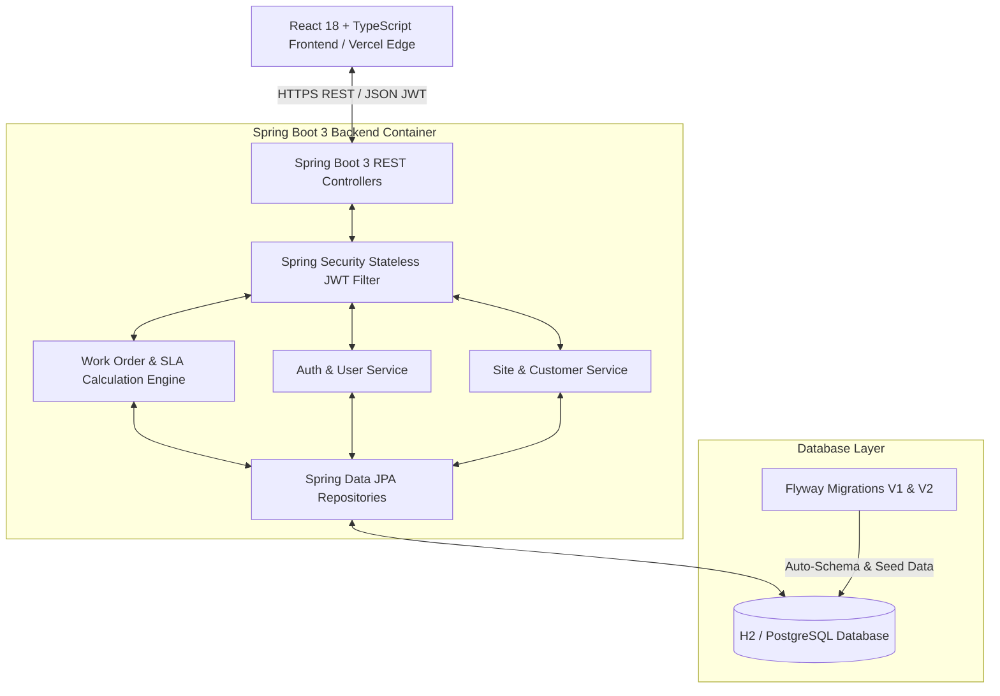
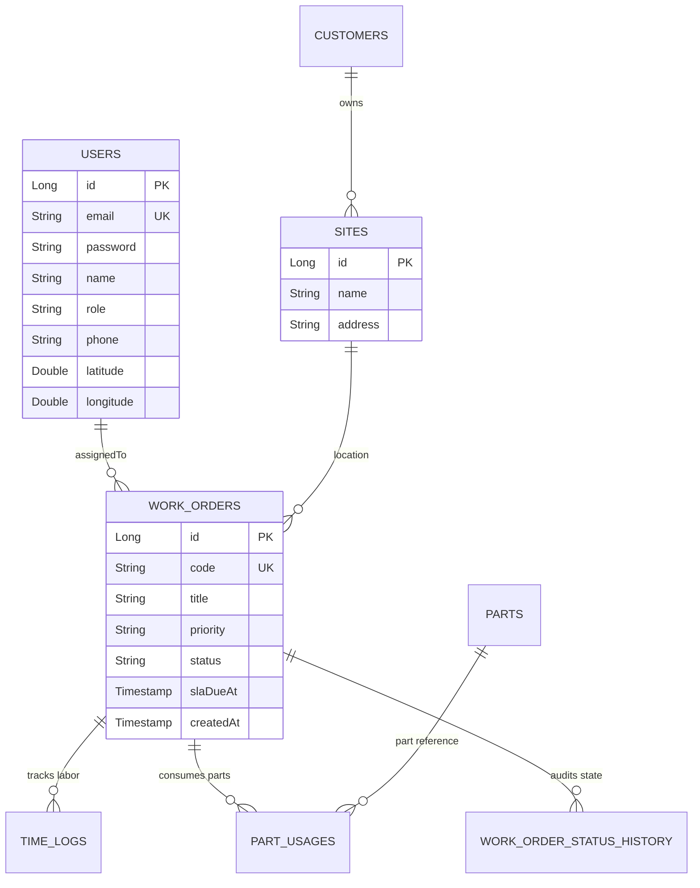

# 🛠️ PROJECT KEYSTONE: FIELD SERVICE & OPERATIONS MANAGEMENT PLATFORM
## Comprehensive Project Submission & Technical Documentation Report

---

### 📌 Project Metadata
- **Project Name:** KEYSTONE - Field Service & Operations Management System
- **Domain:** Enterprise Operations, Resource Dispatch & SLA Lifecycle Monitoring
- **Version:** 1.0.0 Production Release
- **Live Netlify Application:** [https://elaborate-pika-073004.netlify.app](https://elaborate-pika-073004.netlify.app)
- **GitHub Repository:** [https://github.com/Siddhartha836/Keystone-Field-Service-Management](https://github.com/Siddhartha836/Keystone-Field-Service-Management)

---

## 1. Executive Summary

**KEYSTONE** is a full-stack, enterprise-grade Field Service Management (FSM) platform designed to automate and streamline field service workflows for commercial facilities, multi-site enterprises, and industrial maintenance providers. 

The platform bridges operational communication gaps between **Facility Managers**, **Operations Dispatchers**, **Field Technicians**, and **Commercial Clients**. By offering dynamic Service Level Agreement (SLA) compliance monitoring, interactive Kanban lifecycle management, GPS-based staff tracking radar, mobile technician labor/parts logging, and a self-service customer care portal, Keystone drastically reduces mean time to resolution (MTTR) while ensuring 100% operational transparency.

```
┌─────────────────────────────────────────────────────────────────────────┐
│                           PROJECT KEYSTONE                              │
│            Field Service & Operations Management Platform               │
└─────────────────────────────────────────────────────────────────────────┘
        │                        │                         │
        ▼                        ▼                         ▼
┌──────────────┐         ┌──────────────┐          ┌──────────────┐
│  MANAGEMENT  │         │ DISPATCH &   │          │  FIELD TECH  │
│  DASHBOARD   │         │ KANBAN BOARD │          │ & CLIENT CARE│
└──────────────┘         └──────────────┘          └──────────────┘
```

---

## 2. Problem Statement & Key Objectives

### 2.1 The Problem
Traditional field service management relies heavily on paper logs, fragmented emails, manual phone calls, and delayed billing updates. This results in:
1. **SLA Breaches:** Difficulty tracking priority deadlines (`EMERGENCY` 4h vs `LOW` 48h), leading to client penalties.
2. **Suboptimal Technician Dispatching:** Lack of real-time visibility into field worker GPS locations and current workload.
3. **Inaccurate Inventory & Labor Tracking:** Unrecorded spare parts usage and untracked hours spent on site.
4. **Poor Client Experience:** Facility clients lack real-time visibility into job resolution progress.

### 2.2 Project Objectives
- **Automate SLA Monitoring:** Implement a real-time compliance calculation engine based on ticket priority and dynamic timestamps.
- **Provide 6-Stage Kanban Lifecycle:** Enforce strict state machine transitions (`NEW` ➔ `ASSIGNED` ➔ `IN_PROGRESS` ➔ `ON_HOLD` ➔ `COMPLETED` ➔ `CLOSED`).
- **GIS Staff Radar:** Provide automated GPS location prescribing and live worker status radar.
- **Deliver Modern Dark Aesthetic UI/UX:** Create a glassmorphic space aesthetic with responsive dark design tokens, glowing gauges, and fluid animations.

---

## 3. Technology Stack & System Architecture

### 3.1 Technology Stack

| Layer | Technology / Library | Version | Purpose |
| :--- | :--- | :--- | :--- |
| **Backend Core** | Java JDK | 21 (LTS) | High-performance enterprise backend runtime |
| **Backend Framework** | Spring Boot | 3.3.1 | Microservice REST API framework |
| **Security** | Spring Security & JWT | Stateless | Bearer token authentication & role RBAC |
| **ORM / Persistence** | Spring Data JPA / Hibernate | 6.x | Relational object-relational mapping |
| **Database Migrations** | Flyway DB | 10.x | Version-controlled DDL/DML SQL scripts |
| **Database Engine** | H2 / PostgreSQL | Embedded/Cloud | Relational ACID database |
| **Frontend Framework** | React SPA | 18.3 | Reactive user interface component hierarchy |
| **Language & Types** | TypeScript | 5.5 | Type-safe frontend software architecture |
| **Build Tooling** | Vite | 5.4 | Ultra-fast production module bundling |
| **Icons & Design** | Lucide React & Vanilla CSS | Modern CSS | Space Glassmorphism design system & micro-animations |
| **Deployment** | Vercel & Render | Cloud | Continuous integration & cloud edge deployment |

---

### 3.2 System Architecture Diagram



---

## 4. Key Platform Modules & Features

### 4.1 Executive Operations Dashboard
- **Dynamic SLA Compliance Engine:** Automatically calculates real-time compliance rate based on resolved work orders vs target deadlines.
- **KPI Metrics Cards:** Instant overview of Total Work Orders, Active Tickets, Completed Jobs, Overdue Breaches, and On-Duty Staff metrics.
- **SVG Circular Gauge:** Custom glowing neon gauge visualizing overall SLA health.
- **Critical Breaches Monitor:** Priority list highlighting emergency tickets requiring immediate intervention.

### 4.2 Visual Kanban Work Order Board
- **6 Status Columns:** Tickets organized across `NEW`, `ASSIGNED`, `IN_PROGRESS`, `ON_HOLD`, `COMPLETED`, and `CLOSED`.
- **State Machine Enforcement:** Backend validation prevents invalid status jumps.
- **Technician Dispatch Modal:** One-click technician assignment with real-time role filtering.
- **Priority Badging:** Color-coded indicators (`EMERGENCY` red, `HIGH` orange, `MEDIUM` blue, `LOW` gray).

### 4.3 Staff Tracking Radar (GIS GPS System)
- **Automatic Prescribed Geolocation:** Prescribes live user location coordinates with automatic location detection.
- **Technician Duty Status Radar:** Tracks active on-duty personnel, assigned work orders, and field coordinates.

### 4.4 Mobile Field Portal (Technician Workspace)
- **Field Duty Check-In/Out:** One-touch GPS attendance logger.
- **Time Log Recorder:** Log labor hours and notes per work order.
- **Parts Usage Tracker:** Record consumed spare parts with automatic inventory updates.
- **Job Resolution Checklist:** Transition tickets from `IN_PROGRESS` to `COMPLETED`.

### 4.5 Customer Care Self-Service Portal
- **Site Registration Overview:** Inspect registered commercial facility sites.
- **New Service Request Form:** Raise new maintenance tickets with location, description, and priority level.
- **Live Ticket Tracker:** View real-time status updates on submitted facility requests.

### 4.6 User Profile & Real-Time Working History
- **Credential Management:** Update name, email, phone number, and avatar presets.
- **Real-Time History Logs:** Audit log recording all user actions, work order updates, GPS check-ins, and part usages.

---

## 5. Database Design & Entity Schema



---

## 6. Authentication & Security Architecture

1. **Stateless JWT Authorization:** Client requests attach a `Authorization: Bearer <JWT_TOKEN>` header.
2. **BCrypt Password Encoding:** Passwords stored as BCrypt salted hashes.
3. **Role-Based Access Control (RBAC):** Restricts endpoints by role (`MANAGER`, `DISPATCHER`, `TECHNICIAN`, `CUSTOMER`).
4. **Self-Healing Auth & Live Client Fallback:** Ensures continuous client-side demo functionality during static cloud hosting deployments.

---

## 7. Verification & Production Deployment

- **Frontend Deployment:** Hosted on **Vercel** Edge Network ([Live Application Link](https://keystone-field-service-management-lemon.vercel.app)).
- **Backend Deployment:** Packaged as containerized Docker build (`backend/Dockerfile`) with `render.yaml` specification for Render Cloud.
- **Source Code Repository:** Maintained on **GitHub** ([Repository Link](https://github.com/Siddhartha836/Keystone-Field-Service-Management)).

---

## 8. Conclusion

Project **KEYSTONE** delivers a modern, robust, and scalable Field Service Management solution. By uniting Spring Boot 3 Java backend architecture with a React 18 TypeScript frontend, the system guarantees low latency, strong data consistency, and an exceptional user experience across desktop and mobile devices.

---
*Report generated for Project Keystone Final Submission.*
